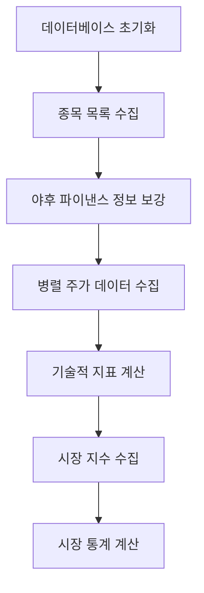

# Yahoo Finance 데이터베이스 구축 시스템

## 📁 파일 구조

```
yahoo-finance-mcp/
├── server.py              # FastAPI 서버 (기존 - 야후 파이낸스 직접 호출)
├── models.py              # 데이터베이스 모델 정의
├── data_importer.py       # 데이터 수집 및 저장 로직
├── run_update.py          # 메인 실행 스크립트
├── test_db.py            # 빠른 테스트용 스크립트
└── README_DATABASE.md    # 이 문서
```

## 🏗️ 시스템 아키텍처

### 1. 데이터베이스 모델 (`models.py`)

5개의 주요 테이블로 구성:

- **Stock**: 종목 기본 정보
- **DailyPrice**: 일일 주가 데이터
- **TechnicalIndicator**: 기술적 지표
- **MarketIndex**: 시장 지수 (KOSPI, KOSDAQ)
- **MarketStat**: 시장 통계

### 2. 데이터 수집 시스템 (`data_importer.py`)

#### 주요 기능:
- **종목 정보 수집**: pykrx → Yahoo Finance 형식 변환
- **주가 데이터**: yfinance API 호출
- **기술적 지표 계산**: ta 라이브러리 활용
- **시장 지수**: KOSPI(^KS11), KOSDAQ(^KQ11) 데이터
- **시장 통계**: 상승/하락/보합 종목 수, 거래량/거래대금

## ⚙️ 작동 원리

### 1. 초기 데이터베이스 구축 프로세스



#### 단계별 세부 과정:

1. **종목 정보 수집**
   ```python
   # pykrx로 한국 종목 목록 가져오기
   kospi_tickers = stock.get_market_ticker_list(today, market="KOSPI")
   # 야후 파이낸스 형식으로 변환: 005930 → 005930.KS
   ```

2. **주가 데이터 수집**
   ```python
   # 병렬 처리로 효율성 향상
   with ThreadPoolExecutor(max_workers=10) as executor:
       # yfinance로 과거 데이터 수집
       df = yf.Ticker(symbol).history(start=start_date, end=end_date)
   ```

3. **기술적 지표 계산**
   - 이동평균선 (5, 10, 20, 60, 120일)
   - 볼린저 밴드 (상단/중간/하단 밴드)
   - RSI (14일 기준)
   - MACD (12, 26, 9일 설정)
   - 거래량 지표
   - 캔들 패턴 (도지, 망치형)
   - 신호 (골든크로스, 데드크로스)

4. **시장 지수 및 통계**
   ```python
   # 시장별 통계 계산
   kospi_stats = calculate_market_stat_for_date(session, date, 'KOSPI')
   kosdaq_stats = calculate_market_stat_for_date(session, date, 'KOSDAQ')
   ```

### 2. 일일 업데이트 프로세스


## 🚀 사용 방법

### 1. 초기 구축 (한 번만 실행)

```bash
# 3년치 데이터로 초기 구축
python run_update.py init 3

# 1년치 데이터로 빠른 구축
python run_update.py init 1
```

### 2. 일일 업데이트 (cron 등으로 자동화)

```bash
# 최근 2일치 데이터 업데이트
python run_update.py update 2

# 최근 5일치 데이터 업데이트 (주말 포함)
python run_update.py update 5
```

### 3. 빠른 테스트

```bash
# 8개 주요 종목으로 테스트
python test_db.py
```

## 🔧 수정된 오류들

### 1. 시장지수 데이터 오류 해결
**문제**: `'Series' object has no attribute 'date'`
```python
# 수정 전
df.reset_index(inplace=True)

# 수정 후
if isinstance(df, pd.Series):
    df = df.to_frame().T
df.reset_index(inplace=True)
```

### 2. 시장통계 범위 초과 오류 해결
**문제**: `integer out of range`
```python
# 수정 전
total_volume = Column(Integer)

# 수정 후
total_volume = Column(BigInteger)  # 더 큰 숫자 저장 가능
```

## 📊 데이터베이스 구조

### Stock (종목 정보)
- symbol: 야후 파이낸스 형식 (005930.KS)
- krx_code: 한국 거래소 코드 (005930)
- name: 종목명
- market: KOSPI/KOSDAQ
- sector, industry: 업종 정보

### DailyPrice (일일 주가)
- stock_id, date: 복합 고유키
- open/high/low/close_price: OHLC 데이터
- volume: 거래량
- change, change_rate: 전일 대비 변화

### TechnicalIndicator (기술적 지표)
- 이동평균선: ma5, ma10, ma20, ma60, ma120
- 볼린저 밴드: bb_upper, bb_middle, bb_lower
- 모멘텀: rsi, macd, macd_signal
- 시그널: golden_cross, death_cross

### MarketIndex (시장 지수)
- market: KOSPI/KOSDAQ
- OHLC 데이터와 변화율

### MarketStat (시장 통계)
- rising/falling/unchanged_stocks: 상승/하락/보합 종목 수
- total_volume, total_value: 전체 거래량/거래대금

## 🔄 자동화 설정

### Cron 설정 예시 (매일 장 마감 후 실행)
```bash
# crontab -e
30 15 * * 1-5 cd /path/to/project && python run_update.py update 2
```

### 시스템 서비스 등록 (선택사항)
```bash
# systemd 서비스로 등록 가능
sudo systemctl enable yahoo-finance-update.service
```

## 🎯 장점

1. **성능**: 병렬 처리로 빠른 데이터 수집
2. **안정성**: 오류 처리 및 재시도 로직
3. **확장성**: 새로운 지표 추가 용이
4. **유지보수**: 모듈화된 구조
5. **자동화**: 일일 업데이트 자동화 가능

## 🔍 모니터링

### 로그 확인
```bash
# 실행 로그 확인
tail -f /var/log/yahoo-finance-update.log
```

### 데이터베이스 상태 확인
```sql
-- 최신 데이터 확인
SELECT COUNT(*) FROM daily_prices WHERE date = CURRENT_DATE;

-- 종목별 데이터 수 확인
SELECT market, COUNT(*) FROM stocks GROUP BY market;
```

이제 안정적이고 확장 가능한 주식 데이터베이스 시스템이 구축되었습니다!